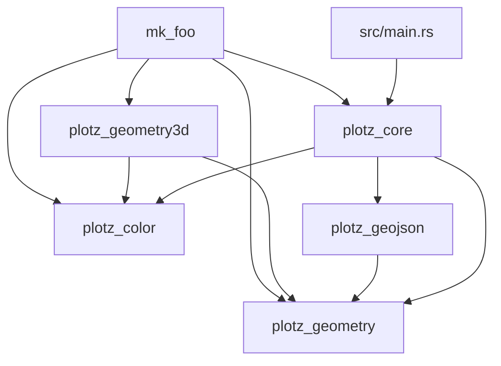

# plotz_rs

A collection of pen plotter libraries, binaries, and utilities.

## Authors

See [`Cargo.toml`](Cargo.toml).

## Contributing

See [`CONTRIBUTING.md`](CONTRIBUTING.md) .

## Development

See [`DEVELOPMENT.md`](DEVELOPMENT.md).

## License

This project is licensed under the Apache 2.0 license.

## Disclaimer

This is not an official Google product.
